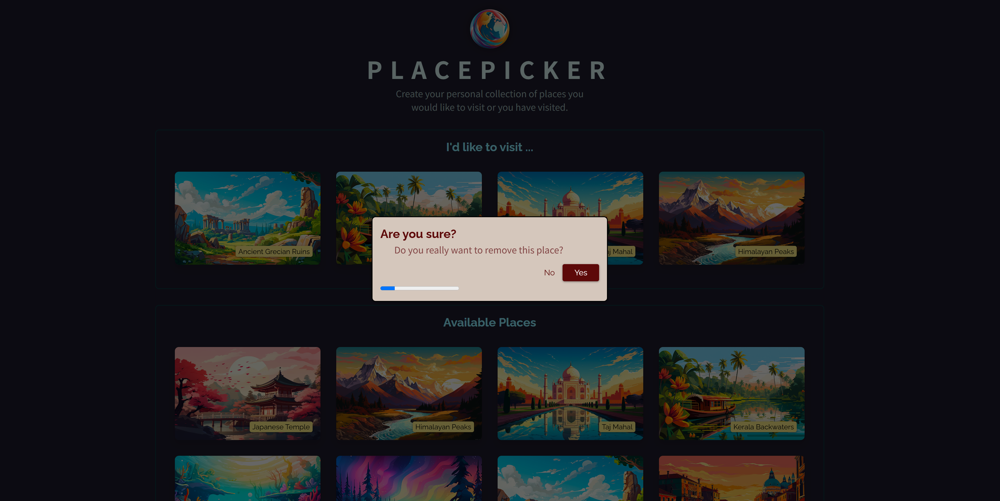
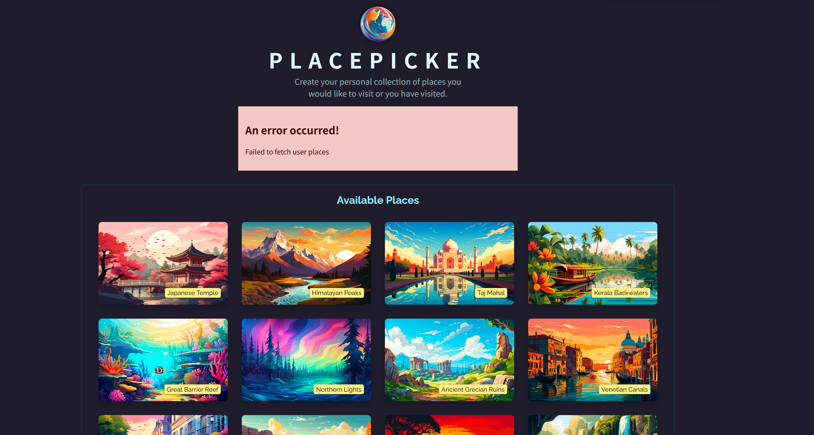
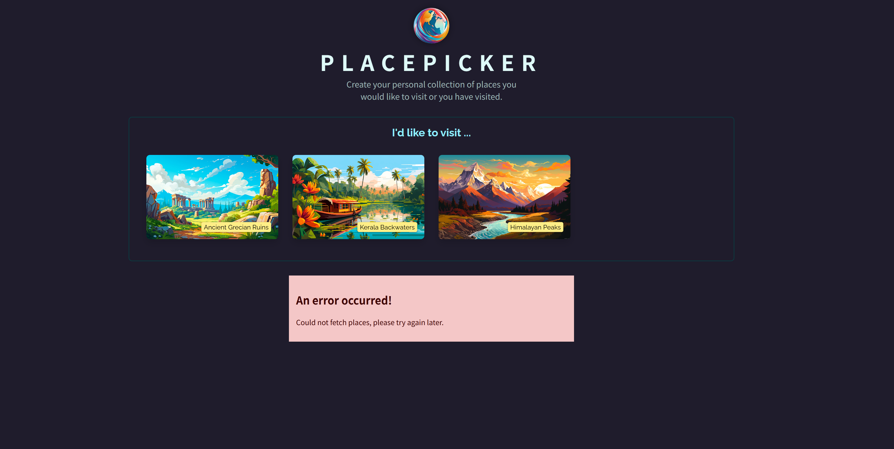

# React Custom Hook 학습 프로젝트

## 프로젝트 개요 이미지






## 📖 프로젝트 소개

이 프로젝트는 React의 **Custom Hook**을 학습하기 위한 실습 프로젝트입니다. "PlacePicker"라는 애플리케이션을 통해 커스텀 훅을 활용한 데이터 페칭, 상태 관리, 그리고 컴포넌트 로직 재사용에 대해 학습했습니다.

## 🎯 학습 목표

1. **Custom Hook의 개념 이해**
2. **데이터 페칭을 위한 커스텀 훅 구현**
3. **로딩 상태 및 에러 처리**
4. **컴포넌트 간 로직 재사용**

## 🏗️ 프로젝트 구조

src/
├── hooks/
│ └── useFetch.js # 커스텀 훅 구현
├── components/
│ ├── AvailablePlaces.jsx # 커스텀 훅 사용 컴포넌트
│ ├── Places.jsx
│ ├── Modal.jsx
│ ├── Error.jsx
│ ├── DeleteConfirmation.jsx
│ └── ProgressBar.jsx
├── http.js # API 호출 함수들
├── App.jsx # 메인 애플리케이션
└── ...

## 🔧 구현한 Custom Hook: `useFetch`

### 주요 기능

- **비동기 데이터 페칭**
- **로딩 상태 관리**
- **에러 처리**
- **데이터 상태 관리**

### 코드 구현

```javascript
import { useEffect, useState } from "react";

export function useFetch(fetchFn, initialValue) {
  const [isFetching, setIsFetching] = useState();
  const [error, setError] = useState();
  const [fetchedData, setFetchedData] = useState(initialValue);

  useEffect(() => {
    async function fetchData() {
      setIsFetching(true);
      try {
        const data = await fetchFn();
        setFetchedData(data);
      } catch (error) {
        setError({ message: error.message || "Failed to fetch data." });
      }
      setIsFetching(false);
    }

    fetchData();
  }, [fetchFn]);

  return {
    isFetching,
    fetchedData,
    setFetchedData,
    error,
  };
}
```

### 반환값

- `isFetching`: 로딩 상태를 나타내는 boolean
- `fetchedData`: 페칭된 데이터
- `setFetchedData`: 데이터를 업데이트하는 함수
- `error`: 에러 객체 (에러 발생 시)

## 📱 사용 예시

### 1. App.jsx에서의 사용

```javascript
const {
  isFetching,
  error,
  fetchedData: userPlaces,
  setFetchedData: setUserPlaces,
} = useFetch(fetchUserPlaces, []);
```

### 2. AvailablePlaces.jsx에서의 사용

```javascript
const {
  isFetching,
  error,
  fetchedData: availablePlaces,
} = useFetch(fetchSortedPlaces, []);
```

## 🎨 주요 학습 내용

### 1. **Custom Hook의 장점**

- ✅ **로직 재사용**: 여러 컴포넌트에서 동일한 데이터 페칭 로직 공유
- ✅ **관심사 분리**: UI 로직과 비즈니스 로직의 분리
- ✅ **테스트 용이성**: 독립적인 로직 테스트 가능
- ✅ **가독성 향상**: 컴포넌트 코드가 더 깔끔해짐

### 2. **상태 관리 패턴**

- **로딩 상태**: 데이터 페칭 중임을 사용자에게 알림
- **에러 상태**: 실패 시 적절한 에러 메시지 표시
- **데이터 상태**: 성공적으로 페칭된 데이터 관리

### 3. **최적화 기법**

- **useCallback**: 함수 참조 안정성 보장
- **의존성 배열**: useEffect의 적절한 의존성 관리
- **초기값 설정**: 빈 배열로 초기화하여 렌더링 에러 방지

### 4. **실제 적용 사례**

- **사용자 장소 목록 페칭**: 저장된 사용자의 방문 예정지 목록
- **이용 가능한 장소 페칭**: 위치 기반으로 정렬된 장소 목록
- **실시간 업데이트**: 낙관적 업데이트와 에러 롤백

## 🚀 실행 방법

### 프론트엔드 실행

```bash
npm install
npm run dev
```

### 백엔드 실행

```bash
cd backend
npm install
npm start
```

## 🛠️ 기술 스택

- **React 19.1.0**: 최신 React 기능 활용
- **Vite**: 빠른 개발 서버 및 빌드 도구
- **Node.js/Express**: 백엔드 API 서버
- **Geolocation API**: 사용자 위치 기반 정렬

## 📚 학습 성과

1. **Custom Hook 패턴 마스터**: 재사용 가능한 로직 추상화
2. **비동기 처리 이해**: Promise, async/await 활용
3. **상태 관리 기법**: 복잡한 상태를 효율적으로 관리
4. **사용자 경험 향상**: 로딩 상태와 에러 처리로 UX 개선
5. **코드 품질 향상**: 모듈화와 관심사 분리
